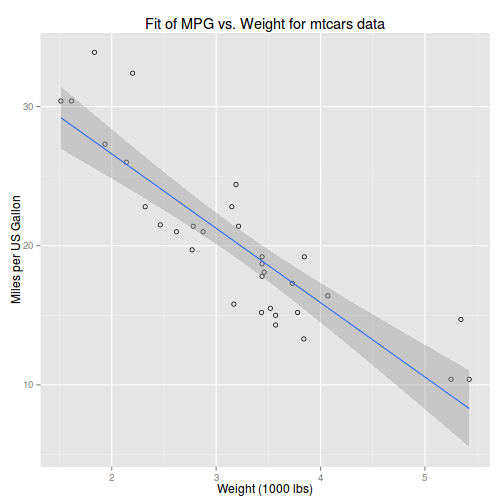

## mtCars prediction App

* The mtCars prediction app lets you predict the MPG of a car given its weight (in 1000 lbs)

* https://jamesmcm.shinyapps.io/myapp/

* It uses the mtCars data with a linear model

* The app is hosted on ShinyApps.io 

* ShinyApps.io allows free hosting of Apps written in R with Shiny.

---

## Model

* The model is:


```r
library(datasets)
data(mtcars)
lm(mpg~wt, mtcars)
```

```
## 
## Call:
## lm(formula = mpg ~ wt, data = mtcars)
## 
## Coefficients:
## (Intercept)           wt  
##      37.285       -5.344
```

---

## Plot of data

* The data looks as follows:

 

---

### Conclusion


* Try out the mtCars prediction app today

* The app is hosted on ShinyApps.io at:
https://jamesmcm.shinyapps.io/myapp/

* This pitch was written in RMarkdown with Slidify

